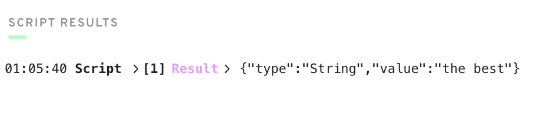

## DAY 1

### Deploy a contract to account 0x03 called "JacobTucker". Inside that contract, declare a constant variable named is, and make it have type String. Initialize it to "the best" when your contract gets deployed.

```
pub contract JacobTucker {

    pub let is: String

    init() {
        self.is = "the best"
    }
}
```


### Check that your variable is actually equals "the best" by executing a script to read that variable. Include a screenshot of the output.

```
import JacobTucker from 0x03

pub fun main(): String {
  return JacobTucker.is
}

```




## DAY 2


### 1. Explain why we wouldn't call changeGreeting in a script.
*because with scripts we can only view information from the blockchain, but cannot modify it*

### 2. What does the AuthAccount mean in the prepare phase of the transaction?
*AuthAccount is the account that signs the transaction*

### 3. What is the difference between the prepare phase and the execute phase in the transaction?
*prepare phase allows to access information in the account, execute phase is more just a syntactic sugar for cleaner code, so developers can put the executable logic in a separate code block. It helps readability of the code.*

### 4. This is the hardest quest so far, so if it takes you some time, do not worry! I can help you in the Discord if you have questions.
- Add two new things inside your contract:
	- A variable named myNumber that has type Int (set it to 0 when the contract is deployed)
	- A function named updateMyNumber that takes in a new number named newNumber as a parameter that has type Int and updates myNumber to be newNumber
- Add a script that reads myNumber from the contract
- Add a transaction that takes in a parameter named myNewNumber and passes it into the updateMyNumber function. Verify that your number changed by running the script again.


```
pub contract HelloWorld {
    pub var greeting: String
    pub var myNumber: Int
    pub fun changeGreeting(newGreeting: String) {
        self.greeting = newGreeting
    }
    pub fun updateNumber(newNumber: Int) {
        self.myNumber = newNumber
    }
    init() {
        self.greeting = "Hello, World!"
        self.myNumber = 0
    }
}
```

```
import HelloWorld from 0x01
transaction(myNewNumber: Int) {
  prepare(signer: AuthAccount) {}
  execute {
    HelloWorld.updateNumber(newNumber: myNewNumber)
  }
}
```

```
import HelloWorld from 0x01
pub fun main(): Int {
    return HelloWorld.myNumber
}
```


---

## DAY 3


### 1. In a script, initialize an array (that has length == 3) of your favourite people, represented as Strings, and log it.

```
pub fun main() {
  var people: [String] = ["Jacob", "Jacob", "Jacob"]
  log(people.length)
}
```

### 2. In a script, initialize a dictionary that maps the Strings Facebook, Instagram, Twitter, YouTube, Reddit, and LinkedIn to a UInt64 that represents the order in which you use them from most to least. For example, YouTube --> 1, Reddit --> 2, etc. If you've never used one before, map it to 0!

```
pub fun main() {
    let orderOFUse: {String: UInt64} = 
      {
        "Facebook": 6, 
        "Instagram": 4,
        "Twitter": 5,
        "YouTube": 1, 
        "Reddit": 2,
        "LinkedIn": 3
      }
    log(orderOFUse)
}
```


### 3. Explain what the force unwrap operator ! does, with an example different from the one I showed you (you can just change the type).


*The force-unwrap operator, ! "unwraps" an optional type by saying: "If this thing is nil, PANIC! If it's not nil, we're fine, but get rid of the optional type."*

```
var id1: UInt64? = 1
var unwrappedId1: UInt64 = id1! // Notice it removes the optional type

var id2: UInt64? = nil
var unwrappedId2: UInt64 = id2! // PANICS! The entire program will abort because it found a problem. It tried to unwrap a nil, which isn't allowed
```


### 4. Using this picture below, explain...
	- What the error message means
	- Why we're getting this error
	- How to fix it


*The value returned is has String? (optional) type, but the signature on the function defined the return type as String
The compiler give error, as a retrieved value from a dictionary is optional String, but the function signature was not optional
2 ways to fix it, either using the force-unwrap operator  at returning the value from the thing dictionary, or the preferred way is to make the function return type String? (optional), so the caller can handle nil values gracefully*

---

## DAY 4


### 1. Deploy a new contract that has a Struct of your choosing inside of it (must be different than Profile).

*see under 3)*


### 2. Create a dictionary or array that contains the Struct you defined.

*see under 3)*

### 3. Create a function to add to that array/dictionary.

```
pub contract HouseParty {
    pub var bands: {Address: Band}
    
    pub struct Band {
        pub let drums: String
        pub let guitar: String
        pub let bass: String
        pub let vocals: String
        // You have to pass in 4 arguments when creating this Struct.
        init(
            drums: String, 
            guitar: String, 
            bass: String,
            vocals: String
            ) 
        {
            self.drums = drums
            self.guitar = guitar
            self.bass = bass
            self.vocals = vocals
        }
    }
    pub fun addBand(drums: String, guitar: String, bass: String, vocals: String, account: Address) {
        let newBand = Band(drums: drums, guitar: guitar, bass: bass, vocals: vocals)
        self.bands[account] = newBand
    }
    init() {
        self.bands = {}
    }
}
```


### 4. Add a transaction to call that function in step 3.


```
import HouseParty from 0x01
transaction(drums: String, guitar: String, bass: String, vocals: String, account: Address) {
    prepare(signer: AuthAccount) {}
    execute {
        HouseParty.addBand(drums: drums, guitar: guitar, bass: bass, vocals: vocals, account: account)
        log("We're done.")
    }
}
```

### 5. Add a script to read the Struct you defined.


```
import HouseParty from 0x01
pub fun main(account: Address): HouseParty.Band {
    return HouseParty.bands[account]!
}
```


